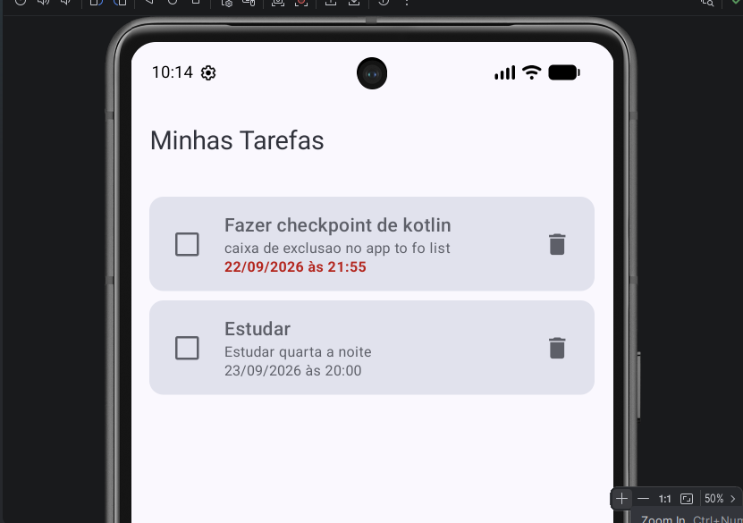
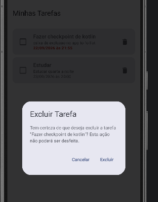
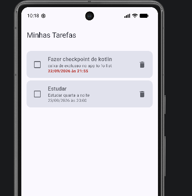
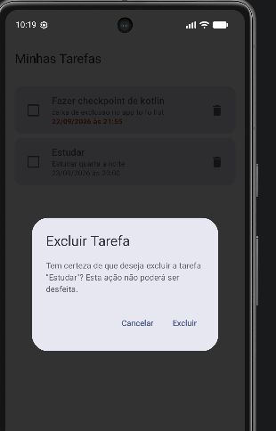
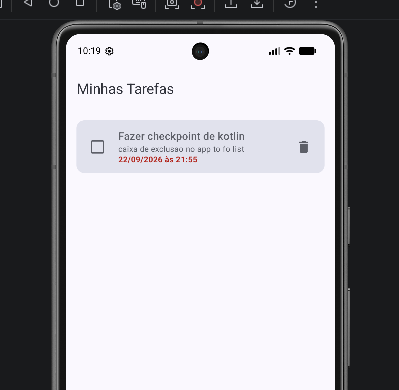

# Evidências - Diálogo de Confirmação de Exclusão de Tarefas
---

## Sequência de Evidências

### 1. Lista de Tarefas Antes da Exclusão
Exibição da lista de tarefas cadastradas na aplicação antes de solicitar qualquer exclusão.

---

### 2. Diálogo de Confirmação Aberto com a Tarefa Selecionada
Ao tocar no ícone de lixeira da tarefa *"Fazer checkpoint de kotlin"*, o diálogo de confirmação é exibido em camada sobre a lista, apresentando o título da tarefa e informando claramente que ela será excluída.

---

### 3. Resultado após Ação de Cancelar
Ao selecionar a opção **Cancelar**, o diálogo é fechado sem realizar nenhuma alteração no banco de dados e a tarefa *"Fazer checkpoint de kotlin"* permanece intacta na lista.

---

### 4. Nova Abertura do Diálogo de Confirmação
O usuário toca novamente no ícone de lixeira da tarefa *"Estudar"*, reabrindo o diálogo de confirmação.

---

### 5. Resultado após Confirmar a Exclusão
Ao selecionar a opção **Excluir**, a tarefa *"Estudar"* é removida do banco de dados Room e a lista é atualizada automaticamente por meio do `StateFlow`, mantendo apenas as demais tarefas.

---

